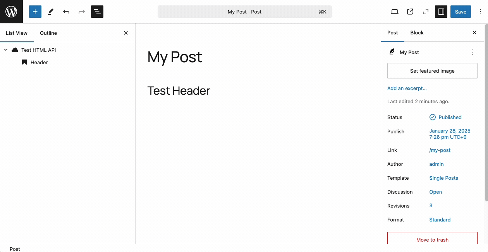

# Helper Blocks

Remote Data Blocks adds some accessory blocks for bindings, listed below.

## Remote HTML Block

Use this block to bind to HTML from a remote data source. This block only works when placed inside a remote data block container and bound to a field containing HTML.



Fields defined by a query’s `output_schema` must have type `html` in order to be available to Remote HTML blocks:

```php
$my_query = [
    /* ... */
    'output_schema' =>
        'is_collection' => false,
        'output_schema' => [
        'type' => [
            'header' => [
                'name' => 'Header',
                'path' => '$.header',
                'type' => 'string',
            ],
            'myHtmlContent' => [
                'name' => 'My HTML Content',
                'path' => '$.myHtmlContent',
                'type' => 'html', // <-- required
            ],
        ],
    ],
];

register_remote_data_block( [
    'title' => 'My HTML API',
    'render_query' => [
        'query' => $my_query,
    ],
] );
```
