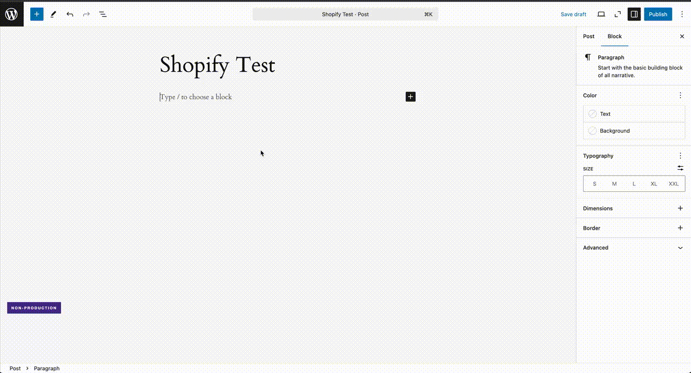

# Create a Shopify remote data block

This tutorial will walk you through connecting a [Shopify](https://www.shopify.com/) data source and how to use the automatically created block in the WordPress editor.

## Shopify API Access

## Create the data source

1. Go to Settings > Remote Data Blocks in your WordPress admin.
2. Click on the "Connect new" button.
3. Choose "Shopify" from the dropdown menu as the data source type.
4. Name this data source (this name is only used internally).
5. Enter the subdomain of your Shopify store. To find this, log into Shopify, the subdomain of your store is the portion of the URL before `myshopify.com`.

If the credentials are correct, you can save the data source. If you receive an error, check the token and try again.

## Insert the block

Create or edit a page or post, then using the Block Inserter, search for the block using the name you provided in step four.

## Patterns and styling

You can use patterns to create a consistent, reusable layout for your remote data. You can read more about [patterns and other Core Concepts](../concepts/index.md#patterns).

Remote data blocks can be styled using the block editor's style settings, `theme.json`, or custom stylesheets. See the [example child theme](https://github.com/Automattic/remote-data-blocks/tree/trunk/example/theme) for more details.

## Code Reference

Check out [a working example](https://github.com/Automattic/remote-data-blocks/tree/trunk/example/shopify) of the concepts above in the Remote Data Blocks GitHub repository.
